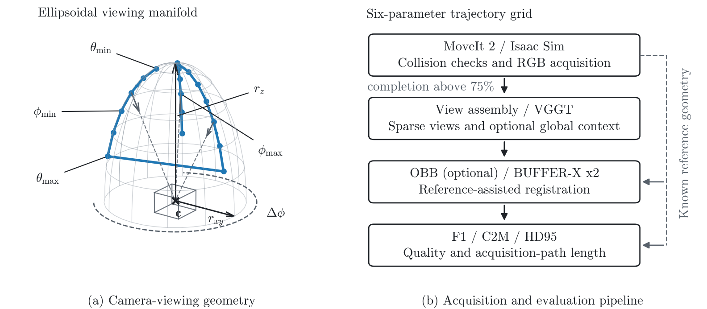

<div align="center">

# Trajectory-Optimized-3D-Reconstruction

**Trajectory design and evaluation for sparse eye-in-hand 3D reconstruction**

Search an ellipsoidal scan family, keep only what a manipulator can actually execute,
reconstruct from sparse views, and score the result against known geometry.

[](../../actions/workflows/tests.yml)
[](pyproject.toml)
[](integrations/)
[](docs/VALIDATION.md)

<picture>
  <source media="(prefers-color-scheme: dark)" srcset="assets/overview-dark.png">
  
</picture>

</div>

---

## What this does

An eye-in-hand camera can reach many viewpoints, but the useful ones are constrained
twice over: by the arm, its tool and the cell around it, and by what a sparse-view
reconstruction can do with the images that come back. This repository connects both
halves into one measurable pipeline.

**(a) Scan geometry.** A scan is six numbers: two ellipsoid radii, two azimuth limits
and two polar-parameter limits. Camera positions follow

```
p(φ, θ) = c + [ r_xy·sinθ·cosφ ,  r_xy·sinθ·sinφ ,  r_z·cosθ ]
```

with the camera always pointing at the focal target `c`, and traversal alternating
direction on successive azimuth slices. Because `r_xy ≠ r_z`, the polar parameter `θ`
is *not* the physical sightline inclination; the two are related by
`β = arctan((r_xy / r_z)·tanθ)`, and the module keeps them distinct.

**(b) Stages.** Every proposal is planned and collision-checked against the full cell
before anything is recorded, so infeasible geometry never reaches the GPU. Admitted
image sequences go to VGGT, optionally preceded by a top-down context frame. The
prediction is registered to known reference geometry with an optional oriented
bounding-box initializer and two BUFFER-X passes, which is what makes a metric
comparison across runs possible at all. Evaluation then reports three quantities that
disagree on purpose: thresholded F1, a conditional cloud-to-mesh distance, and a
bidirectional 95th-percentile distance, alongside the recorded wrist path length.

## Highlights

- **Execution feasibility is treated as a first-class filter.** A 10,000-configuration
  grid is intersected with the executable set before any viewpoint quality is compared.
- **Reference-assisted registration is explicit.** Scale initialization and the two
  rigid updates are composed once and validated, never applied twice.
- **Three metrics, kept separate.** Local surface fit, coverage and boundary error are
  reported side by side; the evaluator stores raw distance arrays, not just summaries.
- **Deterministic selection.** Pareto dominance and threshold-based operating-point
  selection are exact calculations over the runs you supply, with no model fitting and
  no inferred uncertainty.
- **Nothing is silently repaired.** Invalid points are not dropped, empty predictions
  are not replaced with dummy geometry, failed stages do not become successes, and
  units are never inferred.

## Install

```bash
python -m venv .venv && . .venv/bin/activate
python -m pip install -e '.[analysis]'
eyeinhand doctor
```

The core installs on CPU with NumPy, SciPy and Pillow only. Optional extras pull in
what a given stage needs: `geometry` for Open3D and trimesh, `inference` for PyTorch,
`dev` for the test suite. ROS 2, MoveIt 2, Isaac Sim, VGGT and BUFFER-X are external
systems; they are imported lazily and are never bundled.

## Quickstart

```bash
# 1. Inspect the geometric search space (metadata only, not feasible trajectories)
eyeinhand grid --output runs/grid.json

# 2. Build the four input manifests for one acquisition
eyeinhand prepare-study \
  --images captures/frame_000.png captures/frame_001.png \
  --anchor captures/top_view.png --mask masks/gripper.png \
  --anchor-mask masks/top_view_gripper.png \
  --max-total-frames 21 --output runs/study_001

# 3. Reconstruct, register, evaluate
eyeinhand reconstruct --help
eyeinhand register    --help
eyeinhand evaluate    --help

# 4. End-to-end synthetic smoke test, CPU only
eyeinhand demo --output runs/demo.json
```

Step 2 selects exactly one context image, requires a static trajectory mask, checks
for duplicate image bytes and counts the context frame against the total budget. The
21-frame default is the original 20-frame trajectory cap plus one context image; it
does not claim matched total input counts between settings. Use `--unmasked-anchor`
only when an unobstructed top-down view is the intended policy, since a top-down view
can contain the gripper too.

## Pipeline stages

| Stage | Entry point | Requires |
|---|---|---|
| Trajectory family and grid enumeration | `eyeinhand.trajectory` | core |
| Collision scene setup | `integrations/ros2_scene.py` | ROS 2, MoveIt 2 |
| Image capture | `integrations/ros2_capture.py` | ROS 2 |
| Input preparation, masking, budgeting | `eyeinhand prepare-study` | core |
| Sparse-view reconstruction | `eyeinhand reconstruct` | VGGT, PyTorch |
| Reference-assisted registration | `eyeinhand register` | BUFFER-X worker, Open3D |
| Geometric evaluation | `eyeinhand evaluate` | trimesh or Open3D |
| Operating-point selection | `eyeinhand.operating_points` | core |

## Collision-aware simulation setup

`configs/workcell_scene.json` describes the table, the supporting frame, the
**target-object exclusion volume** and the three attached gripper and camera boxes.
Apply it synchronously to a simulated MoveIt planning scene:

```bash
python integrations/ros2_scene.py --simulation --config configs/workcell_scene.json
```

The command updates the planning scene and commands no robot motion. Confirm that the
configured volumes enclose the loaded scene and the attachments before acquisition.
The adapter adds no collision exemption for target objects, so the arm plans around
the objects it is scanning rather than through them.

## Selecting an operating point

A scan family leaves you with many executable trajectories, each described by a motion
cost and several quality measures that disagree on purpose. `eyeinhand.operating_points`
compares such a set exactly, with no bundled data and no model fitting.

```python
from eyeinhand.operating_points import (
    GEOMETRY_COLUMNS, RUN_COLUMNS, load_runs, nondominated_costs,
    select_operating_point, sightline_geometry, supported_f1_length_points,
)

rows = load_runs("runs/summary.csv", RUN_COLUMNS + GEOMETRY_COLUMNS)

best = select_operating_point(rows, min_f1=.85, max_hd95_m=.12)   # shortest feasible run
front = nondominated_costs([[r["path_length_m"], -r["f1_score"], r["hd95_m"]] for r in rows])
supported = supported_f1_length_points(rows)                      # what a weighted sum can return
geometry = sightline_geometry(rows, focal_height_m=.04)           # real inclination, not theta
```

Two details make this worth doing explicitly. A run can be nondominated and still sit
below the concave envelope, which means no weighted sum of cost and quality will ever
return it at any weight; comparing `front` with `supported` is what exposes that.
And because the manifold is an ellipsoid rather than a sphere, the polar parameter is
not the angle the camera actually looks along, so `sightline_geometry` converts it.

Choose the thresholds from the tolerance of the downstream task rather than by tuning.
The full walkthrough, from a trajectory proposal to a selected run, is in
[`docs/WORKFLOW.md`](docs/WORKFLOW.md).

## Repository layout

| Path | Purpose |
|---|---|
| `src/eyeinhand/` | Geometry, trajectory family, frame preparation, registration, metrics, artifact management, operating-point selection, CLI |
| `integrations/` | Optional ROS 2 scene and capture adapters, and the isolated BUFFER-X worker |
| `configs/` | Metric configuration and the collision-scene description of the simulated workcell |
| `tools/` | Renderer for the overview diagram in this README |
| `assets/` | Generated documentation figures |
| `examples/` | Explicitly synthetic fixture for the CPU walkthrough |
| `tests/` | Analytic, synthetic and file-protocol tests |
| `docs/` | Data contracts, the end-to-end workflow and the validation record |

Regenerate the overview diagram after changing the stage graph or the scan geometry:

```bash
python tools/render_diagrams.py --output assets
```

## Tests and validation

```bash
python -m pip install -e '.[dev,analysis]' trimesh
python -m pytest -q
python -m ruff check .
```

The suite covers geometry, metrics, artifact protocols, the registration composition
and the operating-point selection, all with analytic or synthetic fixtures. The registration
CLI test uses an identity-transform protocol worker; it is a file-handling and
composition test, not a BUFFER-X benchmark. Scene tests validate the configuration and
the target-object requirement without executing MoveIt collision checking.
[`docs/VALIDATION.md`](docs/VALIDATION.md) records the measured coverage and states
exactly which runtimes were never exercised.

## Scope and limitations

Read this before drawing conclusions from anything here.

- The admitted fraction of any scan family is a property of a **specific cell, arm and
  tool**. Nothing here predicts what survives collision checking in a different setup.
- CI is infrastructure, not evidence that a robotics experiment was reproduced. The
  test suite uses analytic and synthetic fixtures throughout.
- The finite-set analysis supports exact dominance and threshold selection. It supports
  no significance test, no confidence interval and no causal ranking of trajectory
  parameters.
- Registration uses known reference geometry to establish scale and frame. Neither
  initializer recovers metric scale from RGB alone, and neither claims to.
- This is research software, not a safety controller. Read
  [`SECURITY.md`](SECURITY.md) before running external checkpoints or subprocesses.

## License and notices

No blanket license has been assigned yet, so the rights holders must select and approve
one before public distribution. [`THIRD_PARTY_NOTICES.md`](THIRD_PARTY_NOTICES.md)
records the licensing status and the external systems this package integrates with but
does not bundle. No model weights, font files or captured imagery are included.
Contributions are welcome under the rules in [`CONTRIBUTING.md`](CONTRIBUTING.md).
